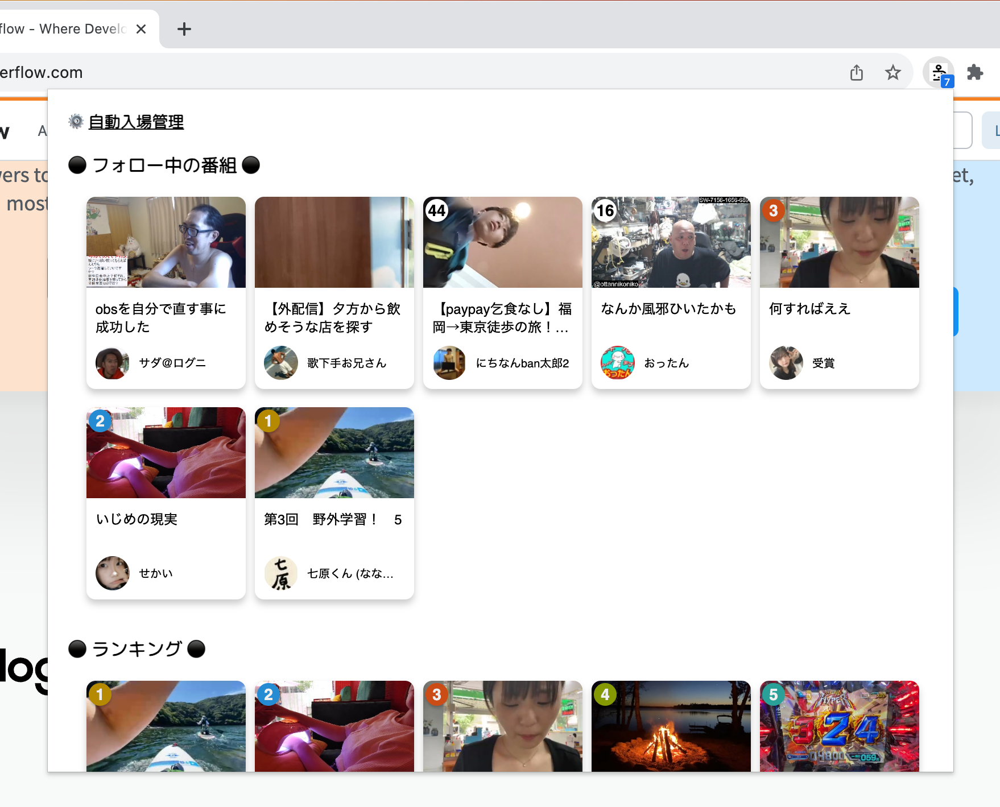

# chrome-nico-alert



An alternative Chrome Extension implementation for Niconama Live Alert.

## Installation

* Will be published on Chrome Web Store soon.

## Build

```shell
# build for production
npm run build-prod

# build for development w/ watch option
npm run build-dev

# clean
npm run clean
```

## License

chrome-nico-alert is under [MIT license](https://en.wikipedia.org/wiki/MIT_License).
